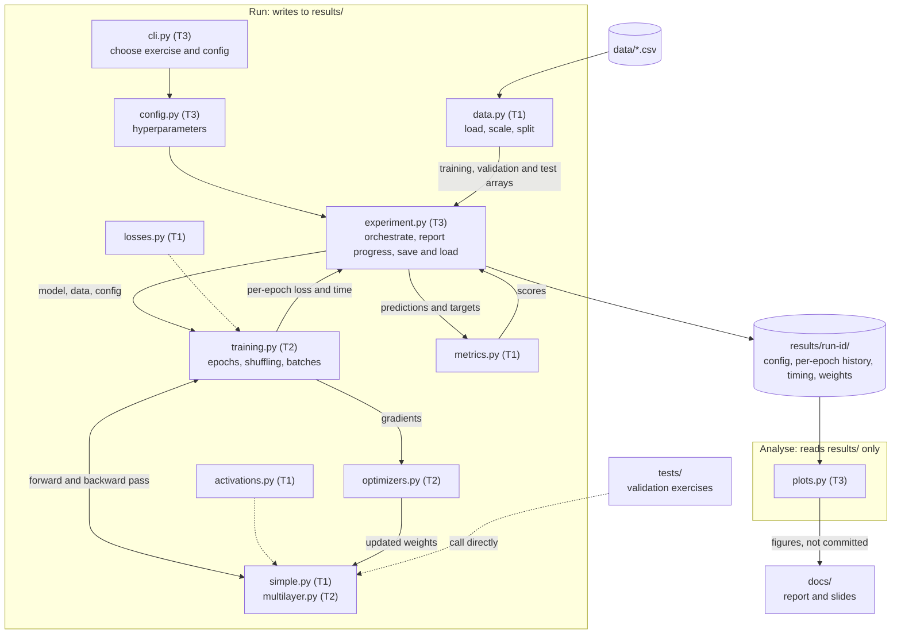

# TP3: Simple and Multilayer Perceptrons

Sistemas de Inteligencia Artificial (72.27), ITBA, second semester 2026. Group of six.

We implement the simple perceptron (step, linear, non-linear) and the multilayer perceptron from scratch with numpy, validate them on toy problems, and apply them to fraud-probability estimation and handwritten-digit classification for a fictional client, CompanyX.

## The assignment

| Part | Problem | Model | Data | Submitted |
|---|---|---|---|---|
| Validation | AND; fit `y = x`; fit `y = tanh(x)`; XOR with `[2, 2, 1]` and `[2, 3, 2, 1]` | Simple perceptron (step, linear, non-linear); MLP | Synthetic | No, but they are our tests |
| Exercise 1 | Probability that an online transaction is fraudulent, with a small "TinyModel" replacing the client's expensive "BigModel" (knowledge distillation) | Simple perceptron, linear vs non-linear | `fraud_dataset.csv` | Yes |
| Exercise 2 | Classify handwritten digits 0–9 | MLP | `digits.csv` for training and tuning; `digits_test.csv` as the production stand-in | Yes |
| Exercise 3 | Exercise 2 again, reaching accuracy ≥ 98% | MLP | Adds `more_digits.csv` | Yes |

### Questions to answer

The labels are used in the work areas below.

**Exercise 1**

- Learning study, using every sample:
  **1L-a** is there underfitting?
  **1L-b** is there capacity saturation?
  **1L-c** which perceptron goes on to the generalization study?
- Generalization study, on the chosen perceptron only:
  **1G-a** which evaluation metrics, and why?
  **1G-b** how is the dataset handled, and how is the best training set chosen?
  **1G-c** best model for the client, plus a recommended fraud-detection threshold.
- The assignment stresses exploring `fraud_dataset.csv` before modelling: column documentation, value ranges, composition, cleanliness.

**Exercise 2**

- **2-a** how do we evaluate the system?
- **2-b** which variants did we try? At minimum: learning rate, architecture, optimization method.

**Exercise 3**

- **3-a** best result with the new data.
- **3-b** techniques used to improve on Exercise 2.
- **3-c** other factors behind the change in performance.

### Optional parts: deferred

We are planning for the obligatory exercises only. The assignment is explicit that optional parts
start once every required part is done, so they are out of scope unless a team finishes early.
Recorded here so nobody has to re-read the enunciado to find them again:

- **Exercise 1:** ReLU in the non-linear perceptron (practical); features to build or discard
  (theory); calibration (theory).
- **Exercises 2 and 3:** robustness to noise (e.g. Gaussian) on the test set; interpretability
  through attribution methods.

The assignment also recommends matrix operations, progress reporting, a stored and extensible configuration, saving and loading models together with their configuration, and keeping experiment runs separate from analysis. The structure below is built around those.

## Getting started

Requires [uv](https://docs.astral.sh/uv/).

```bash
make install   # uv sync: creates .venv with numpy, matplotlib, pytest
make test      # runs the validation exercises in tests/
```

The course materials are committed in `data/`, under their original filenames, so `make install` is all you need — there is nothing to download:

| File | Used by |
|---|---|
| `fraud_dataset.csv` | Exercise 1 |
| `digits.csv` | Exercise 2 (training and tuning) |
| `digits_test.csv` | Exercises 2 and 3 (production stand-in) |
| `more_digits.csv` | Exercise 3 |
| `fraud_dataset_documentation.pdf` | column documentation for Exercise 1 |
| `digit_dataset_loader.py` | the course's reference loader for the digit CSVs; reference only, `data.py` is ours |

These files are committed deliberately, as an exception to the rule below about generated artefacts: they are inputs, they never change, and having them in the repository means everyone trains on byte-identical data. Keep the names as they are — `data.py` and the report both refer to them. Anything else you drop into `data/` stays gitignored.

Experiments will run through `cli.py`, which is not implemented yet (T3 owns it).

## Repository structure

```
.
├── src/perceptrons/
│   ├── activations.py    activation functions and derivatives            T1
│   ├── losses.py         loss functions and their gradients              T1
│   ├── simple.py         simple perceptron: step, linear, non-linear     T1
│   ├── multilayer.py     multilayer perceptron                           T2
│   ├── optimizers.py     weight update rules                             T2
│   ├── training.py       epochs, shuffling, batching                     T2
│   ├── data.py           loading, scaling, splitting                     T1
│   ├── metrics.py        evaluation metrics                              T1
│   ├── plots.py          report figures, built from results/ only        T3
│   ├── config.py         experiment configuration                        T3
│   ├── experiment.py     runs and records experiments                    T3
│   └── cli.py            command-line entry point                        T3
├── tests/                validation exercises and per-module tests
├── notebooks/            exploration only; never imported by src/
├── data/                 course datasets and their documentation (committed)
├── results/              run outputs and figures (gitignored)
├── docs/                 report and slides
├── pyproject.toml        dependencies, managed with uv (uv.lock is committed)
├── Makefile              install, test, clean
└── CLAUDE.md             settings for members who use Claude Code
```

Conventions:

- `src/` never imports from `notebooks/`. Anything that matters moves into `src/` and is imported back.
- Generated files (figures, results, model weights) are never committed. Commit the script or config that produces them.
- Code, identifiers and comments are in English.
- `CLAUDE.md` only affects Claude Code sessions; its structure and commit conventions are the parts that apply to everyone.

## Pipeline



An experiment starts from `cli.py` with a config. `experiment.py` gets the data from `data.py`, passes model, data and config to the training loop, scores the result with `metrics.py`, and writes everything about the run to `results/<run-id>/`. `plots.py` only reads from `results/`, so figures can be redrawn without retraining. The validation tests call the models directly and skip the pipeline.

## Work areas

Six people, three pairs, one obligatory exercise each. A pair owns its exercise end to end: the
report questions for it, the experiments behind them, and a slice of the shared code.

| Team | Exercise | Owners | Modules owned | Report questions |
|---|---|---|---|---|
| T1 | Exercise 1 — fraud probability | _TBD_, _TBD_ | `activations.py`, `losses.py`, `simple.py`, `data.py`, `metrics.py` | 1L-a, 1L-b, 1L-c, 1G-a, 1G-b, 1G-c |
| T2 | Exercise 2 — digit classification | _TBD_, _TBD_ | `multilayer.py`, `optimizers.py`, `training.py` | 2-a, 2-b |
| T3 | Exercise 3 — digits at ≥ 98% | _TBD_, _TBD_ | `config.py`, `experiment.py`, `cli.py`, `plots.py` | 3-a, 3-b, 3-c |

Each team owns the tests for its own modules, including the validation exercises that cover them:
`tests/test_simple.py` and `tests/test_data.py` are T1's, `tests/test_multilayer.py` and
`tests/test_optimizers.py` are T2's, `tests/test_experiment.py` is T3's.

### What "owns" means here

Every exercise needs more modules than its team owns, so ownership is about the interface, not
about who is allowed to type in the file. The owner decides the module's signatures, reviews every
change to it, and is the person to ask before adding to it. Anyone may open a pull request against
a module they do not own — the owner reviews it.

Three modules are used by all three exercises and will attract changes from outside their team.
Expect that rather than fighting it:

- `data.py` (T1) — T1 needs it first, for the Exercise 1 generalization study, but T2 and T3 load
  the digits through it too.
- `metrics.py` (T1) — the Exercise 1 metric choice is the hard one and has to be justified in the
  report, so T1 owns it; T2 adds the digit metrics it needs for 2-a.
- `plots.py` (T3) — it reads the results record and nothing else, and that format is T3's, so T3
  owns it; T1 and T2 add the figures for their own report sections.

### The order things can happen in

The three exercises are not independent and cannot all start at once.

- **Exercise 1 starts immediately.** T1's modules sit at the bottom of the dependency graph, which
  is why the neuron maths is theirs.
- **Exercise 2 is blocked on T1's activations and losses.** T2's first days are the hand
  calculations of one forward and backward step for `[2, 2, 1]` and `[2, 3, 2, 1]`, which need no
  code at all, so the block costs nothing if T1 merges those two modules early.
- **Exercise 3 is Exercise 2 again**, with `more_digits.csv` and better technique, so T3 cannot run
  its own exercise until T2 has a working MLP and a best-known configuration. T3 therefore builds
  the experiment infrastructure first, against a dummy model — and that infrastructure is exactly
  what a search over techniques needs, so none of it is throwaway. How T2's best configuration is
  handed over is a kickoff decision, not something to improvise later.

If T3 runs out of infrastructure work before T2 has a model, the useful next thing is the Exercise
3 data work — loading and merging `more_digits.csv`, checking class balance — as a pull request
into T1's `data.py`.

### T1: Exercise 1 — fraud probability

Owns `activations.py`, `losses.py`, `simple.py`, `data.py`, `metrics.py`, `tests/test_simple.py`,
`tests/test_data.py` (to create).

Implementation is done when:

- the step variant learns AND, the linear variant fits `y = x`, the non-linear variant fits
  `y = tanh(x)`, and the step variant fails on XOR, all as passing tests;
- activations and losses, with their derivatives and gradients, are merged into `develop` early —
  T2 and T3 are blocked on them;
- all four CSVs load into arrays with the agreed shapes and target encoding, with the digit loaders
  merged early for T2 even though T1 does not use them;
- scaling and splitting utilities exist for the Exercise 1 generalization study and for tuning on
  `digits.csv`, with `digits_test.csv` kept out of all tuning;
- every metric matches values computed by hand on small made-up predictions.

Experiments:

- a notebook explores `fraud_dataset.csv` along the assignment's questions — column documentation,
  value ranges, composition, cleanliness — before any modelling;
- the learning study uses every sample and compares the linear and non-linear variants: 1L-a,
  1L-b, 1L-c;
- the generalization study runs on whichever perceptron 1L-c picked: 1G-a, 1G-b, 1G-c, ending in a
  recommended fraud-detection threshold for CompanyX.

### T2: Exercise 2 — digit classification

Owns `multilayer.py`, `optimizers.py`, `training.py`, `tests/test_multilayer.py`,
`tests/test_optimizers.py` (to create).

Implementation is done when:

- one forward and backward step for `[2, 2, 1]` and for `[2, 3, 2, 1]` has been calculated by hand,
  as the assignment recommends, and a test reproduces the numbers;
- XOR is learned with both architectures;
- forward and backward passes are matrix operations, not per-neuron loops — the digits are 28 × 28,
  so a per-neuron loop over 784 inputs will not finish in usable time;
- plain gradient descent and every alternative optimizer we compare minimize a function whose
  minimum is known in advance (e.g. a one-dimensional quadratic), with no model involved;
- the training loop handles epochs, shuffling and batch size, and hands per-epoch loss and timing
  to `experiment.py`.

Experiments: 2-a, and the 2-b variants — learning rate, architecture and optimization method at
minimum. The best configuration found here is what T3 starts from, so record it in a form T3 can
load rather than in the report text only.

### T3: Exercise 3 — digits at ≥ 98%

Owns `config.py`, `experiment.py`, `cli.py`, `plots.py`, `tests/test_experiment.py` (to create).

Implementation is done when:

- a config written to disk and read back is unchanged;
- a run writes its config, per-epoch history, timing and weights to `results/<run-id>/`, and
  reports progress while training;
- a saved model loads with its config and continues training;
- the CLI runs any exercise from a config file;
- plotting helpers produce figures with labelled axes and units from a results record. Use a
  hand-written fake record until the format is merged.

Build against a dummy model until T1's and T2's models merge.

Experiments: starting from T2's best configuration and adding `more_digits.csv`, reach the client's
98% target: 3-a, 3-b, 3-c. 3-c asks what changed other than the techniques, which is mostly a
question about the data — work that one with T1.

## Before anyone branches: agree on the contracts

Parallel work only holds if the boundaries between teams are fixed first. Settle these at a kickoff and record each decision in the docstring of the module that provides it.

| Contract | Provided by → used by | To decide |
|---|---|---|
| Array shapes | T1 → everyone | Shapes of input and output matrices; how digit labels are encoded |
| Activation | T1 → T2 | How a function and its derivative are exposed |
| Loss | T1 → T2 | Loss value, and its gradient with respect to the network output |
| Model | T1, T2 → T2, T3 | Prediction; gradients for every parameter; access to parameters for updating and saving |
| Optimizer | T2 → T3 | How parameters and gradients go in; where optimizer state (e.g. running averages) lives |
| Epoch record | T2 → T3 | What the training loop reports after each epoch |
| Results record | T3 → everyone | What a run writes to `results/`, and in which format |
| Config fields | everyone → T3 | Each team lists the hyperparameters its exercise needs |
| Best Ex2 configuration | T2 → T3 | How Exercise 3 picks up where Exercise 2 stopped |
| Randomness | everyone | How seeds are set so runs are reproducible |

These are design questions for the whole group rather than one owner, since everyone defends them orally:

- Is the simple perceptron a special case of the multilayer perceptron, or a separate implementation?
- Which update mode is the default: online, mini-batch or full batch?
- Which output activation and loss for Exercise 1, and which for Exercises 2 and 3?

## Git workflow

### Branches

- `main`: reviewed, working states only. Updated from `develop` at milestones; nobody commits to it directly.
- `develop`: the integration branch. Every work branch starts here and comes back through a pull request.
- Work branches, created from `develop`:
  - `feat/<short-name>` for implementation, e.g. `feat/mlp-backprop`
  - `fix/<short-name>` for bug fixes
  - `exp/<short-name>` for experiment studies, e.g. `exp/ex2-learning-rate`

### One-time setup

Done once, by whoever creates the GitHub repository:

```bash
git add .
git commit -m "chore: scaffold TP3 project structure and tooling"
git remote add origin <repository-url>
git push -u origin main
git switch -c develop
git push -u origin develop
```

Then protect `main` and `develop` in the GitHub repository settings so changes only land through pull requests.

### Everyday flow

```bash
git switch develop
git pull
git switch -c feat/mlp-backprop
# work, commit
git fetch origin
git rebase origin/develop
make test
git push -u origin feat/mlp-backprop   # add --force-with-lease if the branch was already pushed
# open a pull request into develop
```

### Rules

- Rebase only branches that you alone push to. On a branch shared with someone, merge `develop` into it instead.
- Every pull request is reviewed by someone from a **different** team. We all defend the whole project orally, so review is also how everyone learns the other two exercises.
- `make test` passes before merging.
- Keep pull requests small and within your own team's files. If you have to change another team's module, its owner reviews.
- Commit messages start with `feat:`, `fix:`, `refactor:`, `docs:`, `chore:` or `test:`, use the imperative mood, keep the subject under about 72 characters, and cover one logical change.
- Nothing in `results/` is ever committed. In `data/`, only the original course materials are; anything else you put there stays ignored.

## Milestones

1. **Kickoff:** pairs formed, contracts and design questions settled, `develop` created.
2. **Foundations:** T1's activations, losses and loaders and T3's config merged into `develop` as small, early pull requests, since the other teams are blocked on them.
3. **Validation passes:** every test passes on `develop`; merge `develop` into `main`.
4. **Experiments:** Exercise 1 (T1) and Exercise 2 (T2) run in parallel, on T3's infrastructure as it lands. The Exercise 1 generalization study starts once 1L-c has picked a perceptron. Exercise 3 (T3) starts once T2 has a best configuration to hand over. Merge into `main` after each exercise.
5. **Report and slides** in `docs/`. Optional parts stay out of scope unless everything else is finished early. Final state merged into `main`.
